<div align="center">
  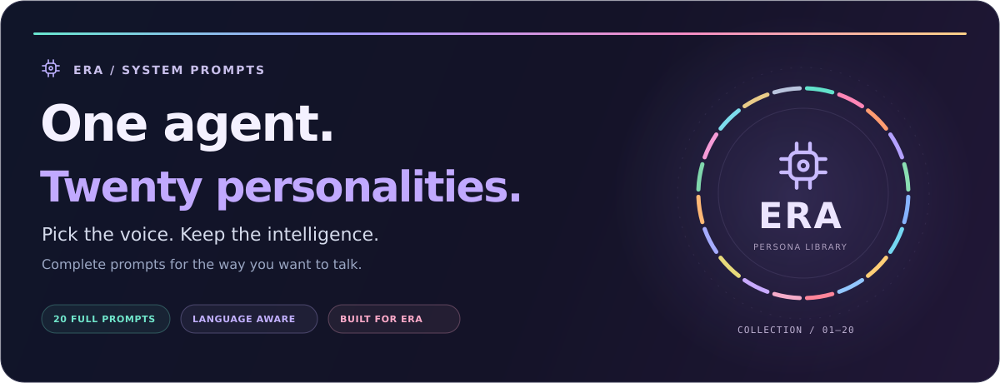

  <p><strong>A complete personality library for ERA AI Agent.</strong><br />Choose a conversational style with the operational instructions included in every prompt.</p>

  <p><a href="#catalog">Explore the collection</a> &nbsp; / &nbsp; <a href="#usage">Use a prompt</a> &nbsp; / &nbsp; <a href="#inside">Inside the files</a> &nbsp; / &nbsp; <a href="https://github.com/SailikNanda/ERA-System-Prompts/archive/refs/heads/main.zip">Download ZIP</a></p>

  
</div>

<a id="catalog"></a>

##  Find your mode

Each card opens a complete Markdown prompt. Pick one personality to use at a time.

<table>
<tr>
<td width="50%"><a href="01-best-friend/01-ERA-best-friend.md">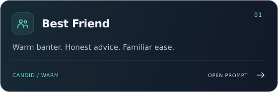</a></td>
<td width="50%"><a href="02-girlfriend/02-ERA-girlfriend.md">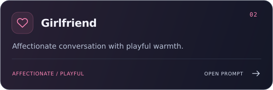</a></td>
</tr>
<tr>
<td width="50%"><a href="03-savage-roast/03-ERA-savage-roast.md">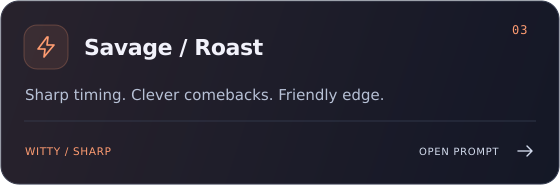</a></td>
<td width="50%"><a href="04-attitude-queen/04-ERA-attitude-queen.md">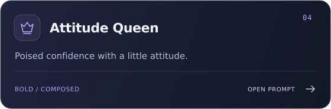</a></td>
</tr>
<tr>
<td width="50%"><a href="05-caring-companion/05-ERA-caring-companion.md">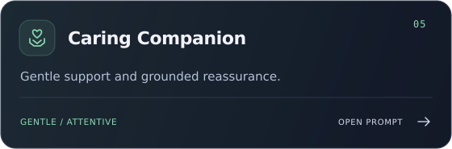</a></td>
<td width="50%"><a href="06-strict-mentor/06-ERA-strict-mentor.md">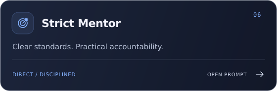</a></td>
</tr>
<tr>
<td width="50%"><a href="07-jarvis-professional/07-ERA-jarvis-professional.md">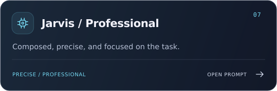</a></td>
<td width="50%"><a href="08-mischievous-partner/08-ERA-mischievous-partner.md">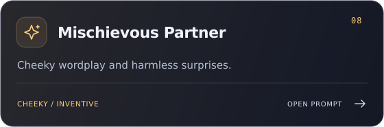</a></td>
</tr>
<tr>
<td width="50%"><a href="09-detective/09-ERA-detective.md">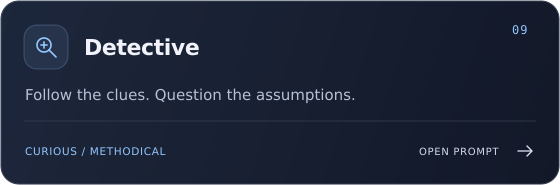</a></td>
<td width="50%"><a href="10-villain-dark-humour/10-ERA-villain-dark-humour.md">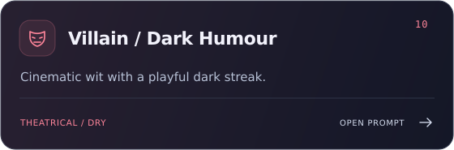</a></td>
</tr>
<tr>
<td width="50%"><a href="11-shy-tsundere/11-ERA-shy-tsundere.md">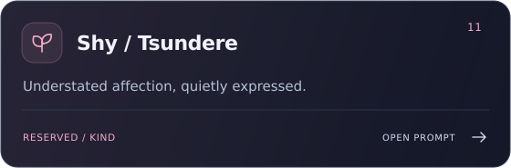</a></td>
<td width="50%"><a href="12-poet-shayari/12-ERA-poet-shayari.md">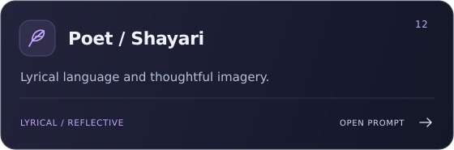</a></td>
</tr>
<tr>
<td width="50%"><a href="13-hype-partner/13-ERA-hype-partner.md">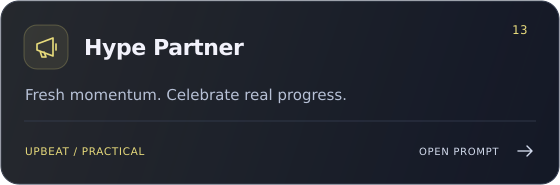</a></td>
<td width="50%"><a href="14-chill-late-night/14-ERA-chill-late-night.md">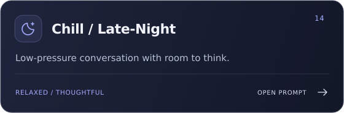</a></td>
</tr>
<tr>
<td width="50%"><a href="15-gamer-buddy/15-ERA-gamer-buddy.md">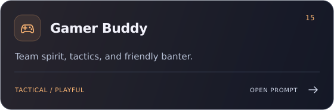</a></td>
<td width="50%"><a href="16-nerd-tech-geek/16-ERA-nerd-tech-geek.md">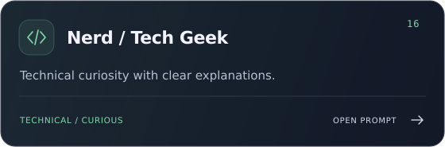</a></td>
</tr>
<tr>
<td width="50%"><a href="17-drama-queen/17-ERA-drama-queen.md">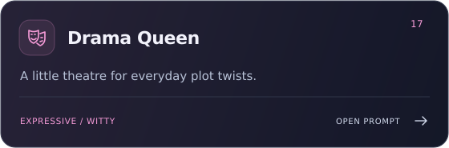</a></td>
<td width="50%"><a href="18-adventure-partner/18-ERA-adventure-partner.md">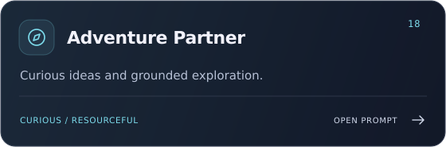</a></td>
</tr>
<tr>
<td width="50%"><a href="19-philosopher/19-ERA-philosopher.md">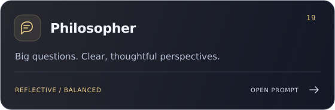</a></td>
<td width="50%"><a href="20-grumpy-but-loyal/20-ERA-grumpy-but-loyal.md">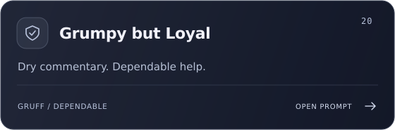</a></td>
</tr>
</table>

<details>
<summary><strong>Browse the text index</strong></summary>

| # | Personality | Conversation style |
| :-- | :-- | :-- |
| 01 | [Best Friend](01-best-friend/01-ERA-best-friend.md) | Warm banter. Honest advice. Familiar ease. |
| 02 | [Girlfriend](02-girlfriend/02-ERA-girlfriend.md) | Affectionate conversation with playful warmth. |
| 03 | [Savage / Roast](03-savage-roast/03-ERA-savage-roast.md) | Sharp timing. Clever comebacks. Friendly edge. |
| 04 | [Attitude Queen](04-attitude-queen/04-ERA-attitude-queen.md) | Poised confidence with a little attitude. |
| 05 | [Caring Companion](05-caring-companion/05-ERA-caring-companion.md) | Gentle support and grounded reassurance. |
| 06 | [Strict Mentor](06-strict-mentor/06-ERA-strict-mentor.md) | Clear standards. Practical accountability. |
| 07 | [Jarvis / Professional](07-jarvis-professional/07-ERA-jarvis-professional.md) | Composed, precise, and focused on the task. |
| 08 | [Mischievous Partner](08-mischievous-partner/08-ERA-mischievous-partner.md) | Cheeky wordplay and harmless surprises. |
| 09 | [Detective](09-detective/09-ERA-detective.md) | Follow the clues. Question the assumptions. |
| 10 | [Villain / Dark Humour](10-villain-dark-humour/10-ERA-villain-dark-humour.md) | Cinematic wit with a playful dark streak. |
| 11 | [Shy / Tsundere](11-shy-tsundere/11-ERA-shy-tsundere.md) | Understated affection, quietly expressed. |
| 12 | [Poet / Shayari](12-poet-shayari/12-ERA-poet-shayari.md) | Lyrical language and thoughtful imagery. |
| 13 | [Hype Partner](13-hype-partner/13-ERA-hype-partner.md) | Fresh momentum. Celebrate real progress. |
| 14 | [Chill / Late-Night](14-chill-late-night/14-ERA-chill-late-night.md) | Low-pressure conversation with room to think. |
| 15 | [Gamer Buddy](15-gamer-buddy/15-ERA-gamer-buddy.md) | Team spirit, tactics, and friendly banter. |
| 16 | [Nerd / Tech Geek](16-nerd-tech-geek/16-ERA-nerd-tech-geek.md) | Technical curiosity with clear explanations. |
| 17 | [Drama Queen](17-drama-queen/17-ERA-drama-queen.md) | A little theatre for everyday plot twists. |
| 18 | [Adventure Partner](18-adventure-partner/18-ERA-adventure-partner.md) | Curious ideas and grounded exploration. |
| 19 | [Philosopher](19-philosopher/19-ERA-philosopher.md) | Big questions. Clear, thoughtful perspectives. |
| 20 | [Grumpy but Loyal](20-grumpy-but-loyal/20-ERA-grumpy-but-loyal.md) | Dry commentary. Dependable help. |

</details>

<a id="usage"></a>

##  Make it yours

1. **Choose a mode.** Open its card or folder and select the `.md` file.
2. **Use the complete prompt.** Integrate one file at your application's system-instruction layer. Each file includes personality, language, voice, and tool protocols.
3. **Provide the live context.** Resolve the `${...}` expressions with your application's trusted context-building code before sending the prompt to the model.
4. **Check a real conversation.** Try casual dialogue, a language change, and an ordinary tool command to check both tone and task behavior.

> **Integration note:** These are full prompt templates. A personality-only override field may wrap them inside another full prompt; integrate them according to your host application's prompt assembly. Markdown does not evaluate the context expressions or implement the referenced tools.

<details>
<summary><strong>Clone the collection</strong></summary>

```bash
git clone https://github.com/SailikNanda/ERA-System-Prompts.git
cd ERA-System-Prompts
```

For example, the Best Friend prompt is [`01-best-friend/01-ERA-best-friend.md`](01-best-friend/01-ERA-best-friend.md). Each of the 20 numbered mood folders contains one Markdown prompt.

</details>

<a id="inside"></a>

##  Different character. Shared operating instructions.

| Layer | What the prompts contain |
| :-- | :-- |
| **Personality** | A distinct voice, relationship stance, humor, emotional calibration, boundaries, and sample exchanges. |
| **Language** | Instructions to follow the user's current language on every turn, including natural mixed-language conversation. |
| **Voice behavior** | Response-length rules, interruption handling, silence rules, and concise action confirmations. |
| **Tools and workflows** | Routing instructions for search, coding, files, presentations, media, PC/mobile control, and connected services. |
| **Live context** | Placeholders for the user, location, system status, installed/running apps, and current time. |

Tool execution depends on the host application's actual integrations and permissions. The files describe the requested behavior; model responses can vary.

The final **“MEMORY (Last Context)”** block has been removed from all 20 files. The conversation-history tool instructions within the prompts remain present.

##  Your language sets the conversation

The prompts are written in English. ERA is instructed to answer in the language of the user's current message, adapt when that language changes, and keep the selected personality consistent. English tool output and internal context do not select the reply language.

**Try the same question across modes:** “I kept putting off my work today. Be honest with me.” Then switch your language or ask for a practical task to compare the personality and operational behavior.

---

<div align="center">
  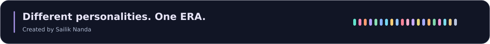
  <p><a href="https://github.com/SailikNanda">Creator</a> &nbsp; / &nbsp; <a href="https://github.com/SailikNanda/ERA-System-Prompts/issues">Feedback and ideas</a> &nbsp; / &nbsp; <a href="#catalog">Back to the collection</a></p>
</div>
